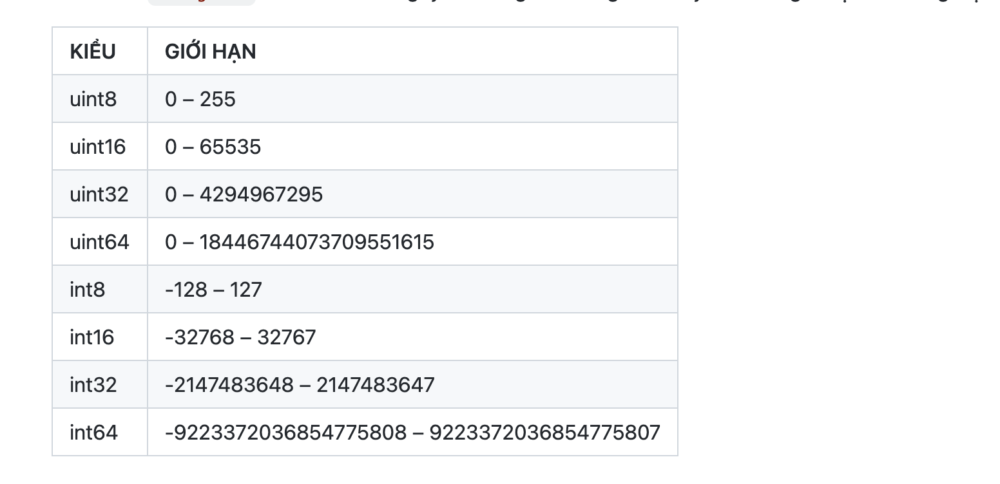
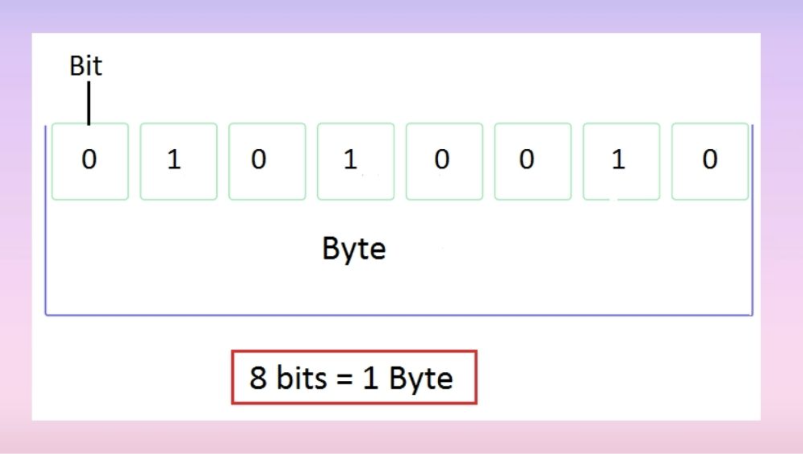

Go's basic types are

bool

string

int  int8  int16  int32  int64
uint uint8 uint16 uint32 uint64 uintptr
- uint tức là unsigned int – là kiểu số nguyên không âm


byte // alias for uint8

rune // alias for int32
     // represents a Unicode code point

float32 float64

complex64 complex128

- int8 => 8bit
- int16 => 16bit
- int32 => 32bit
- int64 => 64bit
- 1byte sẽ biểu thị cho 256 giá trị từ 0 -> 255
- 1 bit biểu thị là số 0 và 1  8bit = 1 byte


## Zero values: có thể hiểu là giá trị mặc định

```go
package main

import "fmt"

func main() {
	var i int
	var f float64
	var b bool
	var s string
	fmt.Printf("%v %v %v %q\n", i, f, b, s)
     // 0 0 false ""
}
```

## Type conversions
The expression T(v) converts the value v to the type T.

Some numeric conversions:
```go
var i int = 42
var f float64 = float64(i)
var u uint = uint(f)
```
Or, put more simply:
```
i := 42
f := float64(i)
u := uint(f)
```

- Chú ý khi ép kiểu từ to xuống nhỏ nếu dữ liệu lớn hơn thì có thể dẫn đến vấn đề
```go
package main

import (
	"fmt"
	"math"
)

func main() {
	var x, y int = 3, 4
	var f float64 = math.Sqrt(float64(x*x + y*y))
	var z uint = uint(f)
	fmt.Println(x, y, z)
}
```
